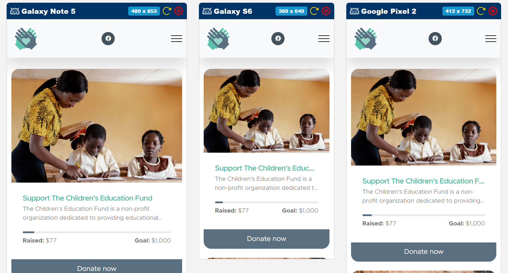
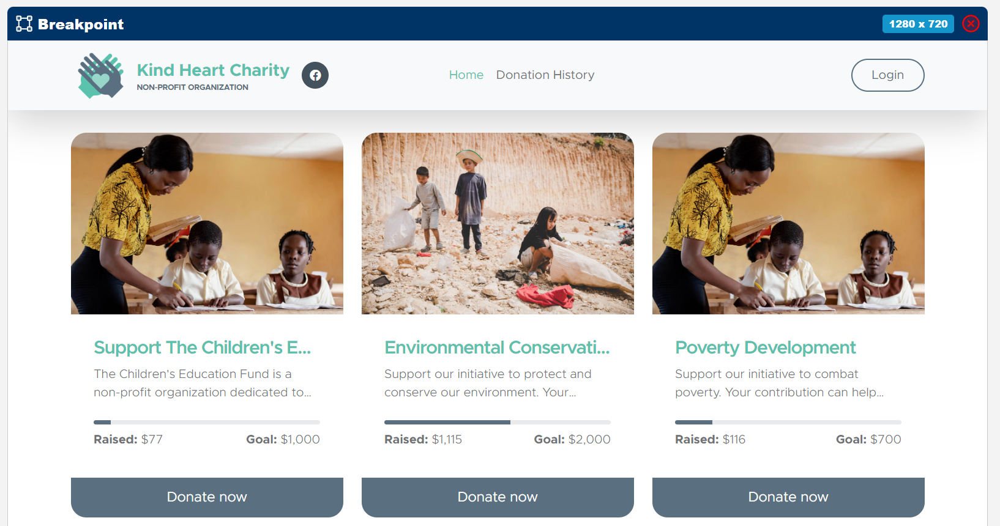
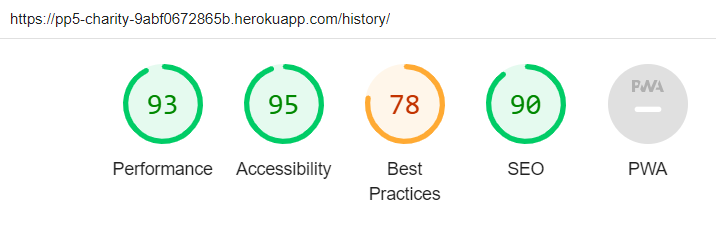
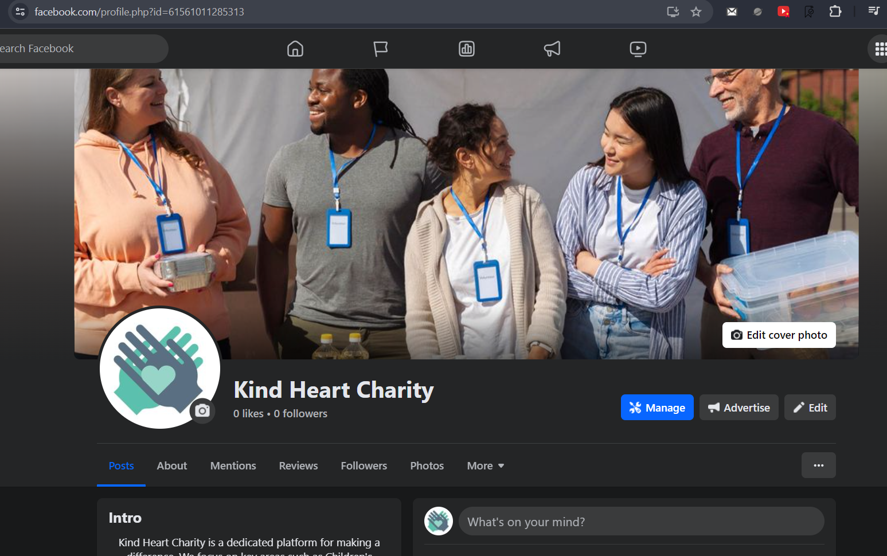
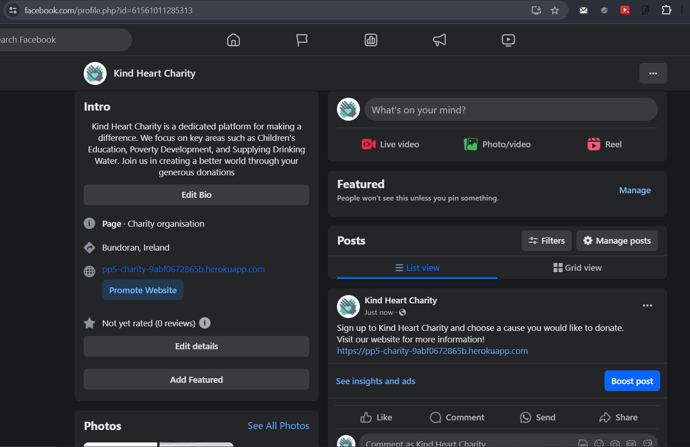
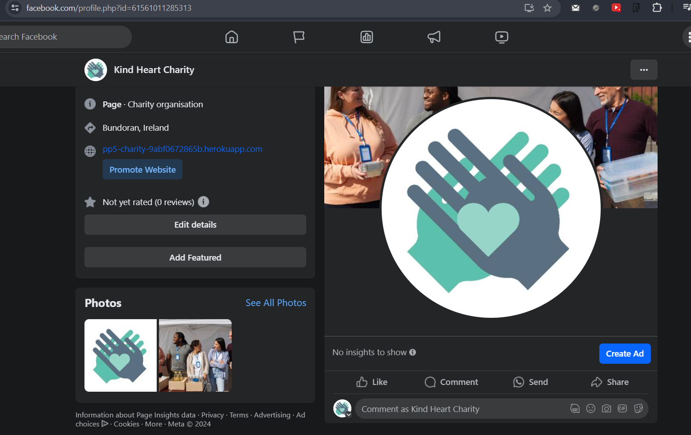
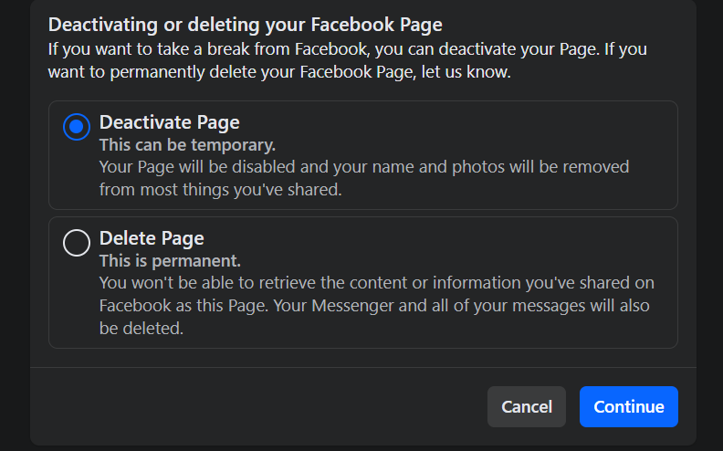
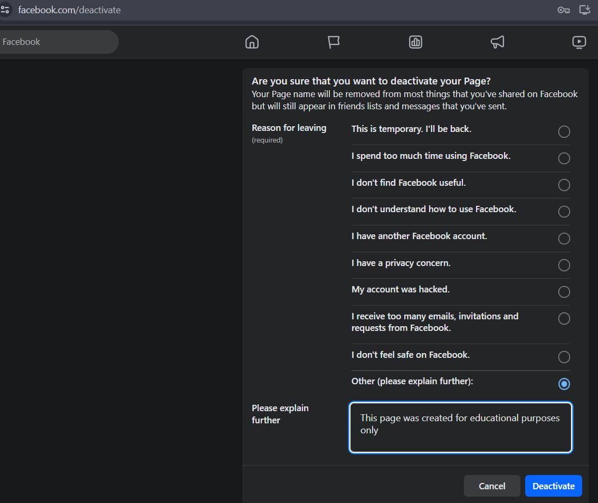

# Kind Heart Charity

Kind Heart Charity is a web-based application designed to facilitate and manage the process of charitable donations. The application is built using Django and JavaScript, with package management handled by pip for Python. The application allows users to browse through various causes and make donations. Each donation is associated with its respective cause. Users can also track their donation history, providing a dynamic and interactive charity experience. The application has two main user roles: User and Administrator. A User can browse the causes, make donations, and track their donation history. An Administrator, on the other hand, has the ability to add, delete, and modify causes in the application, providing comprehensive management of the charity's causes. The application ensures secure user authentication and role-based access to various features. It also includes robust error handling and user notifications for a smooth user experience. The project uses a PostgreSQL database for data storage, managed through Django's ORM. The application's user interface is designed to be intuitive and user-friendly, ensuring a seamless user experience. Additionally, the project integrates with Stripe for secure payment processing, allowing users to make donations using their preferred payment methods. Data storage, managed through Django's ORM. The application's user interface is designed to be intuitive and user-friendly, ensuring a seamless user experience.

---

[View live project here](https://pp5-charity-9abf0672865b.herokuapp.com)





## The application implements the following features:

- Access to the donation cards and donation history is available to all users, including unregistered users.
- Access for making donations and all edit, update, delete actions is only possible for registered users.
- The application has two user roles: Donors and Administrator.
- Registration of a new user (with the role of Donor) through the user interface.

Common functionality for both roles includes:

- Logging into the application through a login form.
- Viewing all causes.
- If the user will try to access the route that is not exist, the user will be redirected to the 404 page.
- There are [tooltips](https://getbootstrap.com/docs/5.3/components/tooltips) for logout and delete button.
- There are [toasts](https://getbootstrap.com/docs/5.3/components/toasts) for all create, update and delete operations, which provide current user details about
  what he\she has just done.
- All input fields in this application are mandatory and have a validation on the client side.

Donor functionality:

- Making a donation to a cause.
- Viewing the donation history.
- Change personal information on the donation page.
- Does not have access to the creation a new donation card page, if the user tries to access this page, the 
  user will be displayed toast with message: "You are not allowed to access to this page".
- Editing personal information in the donation page.
- Subscribe to a newsletter from the donation page.

Administrator functionality:

- Adding new cause.
- Editing cause.
- Deleting the cause only for cards where there were not donations yes.

### Existing Features

- **Home**

  - Unregistered user:
  
    - View list of donation cards.
    - There is a hover effect on each Donation card expanding title and description if the content is bigger than 
      default container height.
    - On pushing on donation button, the user will be redirected to the login page.  
    
  - Administrator:

    - View list of donation cards.
    - Edit an existing donation card.
    - Delete donation card. The card can be deleted only if there were no donations yet.

  - Donor:

    - View list of donation cards.
    - The cards where donation goal is reached are disappearing with delay after a few seconds the donation button 
      was displayed.
    - Select a cause for donation.

- **Donate**
  - There is a toast with card number when the user come to this page.
  - This form can be reached from the Home page by clicking on the Donate button.
  - The administrator can not access this page. If the administrator will try to access this page, he/she will be 
    redirected to the Home page.
  - On this form the Donor can change the cause of donation, the amount of donation, first name, second name, email.
  - The block with personal information is hiding automatically with a short delay if the user has already done a 
    donation earlier and the fields with personal information was fulfilled after hiding the information toast. 
    These events are connected with each other.
  - There is also option to subscribe to the newsletter.
  - The field custom donation amount is connected with default donation amounts. If the user will press one of the 
    default donation amounts, this amount will be copied into custom amount field, and vice versa if the user will 
    type amount manually the amount which is one of the default donation amounts will be highlighted.
  - After pressing the Submit button, the user will see a spinner on this button, and the label on this button will 
    be changed on Transaction processing, after successful transaction Donor will be redirected on the History page, 
    and see the Toast with amount which has just been donated. There is also implemented error handler for this 
    button. If any error happens during the transaction, the user will see the toast with the message which 
    describes error, and will be redirected to the Home page.

- **History**

  This page is available for any users even unauthorized.  
  There are 2 tables on this page.

  - Donation history (each single transaction).  It shows the history of donations. The user can see the date of 
    donation, the amount of donation, and the cause of donation. The number of columns in this table is changing 
    depending on the screen width.
  - Aggregated donations grouped by donor. It shows the total amount of donations for each donor. This table is sorted 
       by the total amount of donations in descending order. If the user is authorized, the row with his/her name 
    will be highlighted. 


- **Create Donation Card**
  - Only user with the role Administrator can access this page. If the user with other roles will try to access this 
    page, he/she will see a toast with message: "You are not allowed to access to this page".
  - The new donation card can be created on this page.
  - The minimum donation amount is $100.
  - All fields on this form are mandatory. The validation runs after pressing the Submit button.


### Features Left to Implement

- Sorting, filtering, and searching for donation cards and history.
- Pagination for donation cards.
- Pagination for history do flexible for large content.

## GitHub Project Board

The project was managed using a [GitHub Project Board](https://github.com/users/SVDotsenko/projects/6)


## Data Model

1. **User Model**: This is a built-in Django model that represents the users of the application. It includes fields for username, password, email, first name, and last name. The User model is used for authentication and authorization in the Django framework.

2. **Donation Model**: This model represents the causes for which donations can be made. It includes the following fields:
    - `title`: A character field with a maximum length of 200 characters that stores the title of the cause.
    - `description`: A text field that stores the description of the cause.
    - `goal`: An integer field that stores the donation goal for the cause.

3. **StripeTransaction Model**: This model represents the transactions made through Stripe. It includes the following fields:
    - `stripe_charge_id`: A character field with a maximum length of 50 characters that stores the Stripe charge ID.
    - `amount`: An integer field that stores the amount of the transaction.
    - `timestamp`: A datetime field that stores the timestamp of the transaction.

4. **Payment Model**: This model represents the donations made by users. It includes the following fields:
    - `user`: A foreign key field linking to the User model. It represents the user who made the donation. When a User instance is deleted, the associated Payment instances will also be deleted.
    - `donation`: A foreign key field linking to the Donation model. It represents the cause to which the donation was made. When a Donation instance is deleted, the associated Payment instances will also be deleted.
    - `stripe_payment`: A one-to-one field linking to the StripeTransaction model. It represents the Stripe transaction associated with the donation. When a StripeTransaction instance is deleted, the associated Payment instance will also be deleted.

The User model handles user authentication, the Donation model represents the causes for donations, the StripeTransaction model represents the Stripe transactions, and the Payment model represents the donations made by users and their associated Stripe transactions.


## Technologies Used

### Languages Used

- [HTML5](https://en.wikipedia.org/wiki/HTML5)
- [CSS3](https://en.wikipedia.org/wiki/Cascading_Style_Sheets)
- [JavaScript](https://en.wikipedia.org/wiki/JavaScript)
- [Python 3.9.19](https://www.python.org/)

### Frameworks, Libraries & Programs Used

1. [Bootstrap icons 1.11.3:](https://icons.getbootstrap.com)
   - Bootstrap icons was used on all pages throughout the website to add icons for aesthetic and UX purposes.
1. [Bootstrap 5.3.3:](https://getbootstrap.com/docs/5.3/getting-started/introduction)
   - Bootstrap was used to assist with the responsiveness and styling of the website.
1. [jQuery 3.7.1:](https://jquery.com)
   - jQuery came with Bootstrap to make the navbar responsive but was also used to show tooltips.
1. [Google Chrome 124.0.6367.62:](https://www.google.com/chrome)
   - Google Chrome was used as a browser to render and debug this project.
1. [Django 4.1.13:](https://www.djangoproject.com)
   - Django is a high-level Python web framework that encourages rapid development and clean, pragmatic design.
   - There were also used other [libraries](requirements.txt) in this project.
1. [ElephantSQL:](https://www.elephantsql.com)
   - ElephantSQL was used to store data.
1. [Node.js 20.12.2:](https://nodejs.org)
   - Node.js was used to run JavaScript unit-tests.
1. [npm 10.7.0:](https://www.npmjs.com)
   - npm was used as a package manager for installing [dependencies](package.json).
1. [Jest 26.6.3:](https://jestjs.io)
   - Jest was [used](package.json) for writing unit-test for JavaScript part of this Project.
1. [Coverage 7.4.4:](https://coverage.readthedocs.io)
   - Coverage was used to measure code coverage of Python code.
1. [Git 2.39.1:](https://git-scm.com)
   - Git was used for version control to commit and Push code to GitHub.
1. [GitHub:](https://github.com)
   - GitHub was used to store the projects code after being pushed from Git.
1. [Heroku:](https://www.heroku.com)
   - Heroku was used to deploy the project.
1. [Bash 5.2.12:](https://www.gnu.org/software/bash/manual)
   - Bash was [used](coverage.sh) to automate running Test Coverage reports.
1. [GitHack:](https://raw.githack.com)
   - GitHack was used to render Code coverage reports when you click on it on this page.
1. [Far Manager 3.0.5700.0:](https://www.farmanager.com)
   - Far Manager was used to work with files.
1. [PyCharm 2024.1.2 (Professional Edition):](https://www.jetbrains.com/pycharm)
   - PyCharm was used to write all code for this project.
1. [Microsoft Windows 10.0.19045 Enterprise:](https://www.microsoft.com)
   - Windows was used as an operating system for development this project.
1. [Stripe 2.43.0:](https://stripe.com)
   - Stripe was used to handle payments.

## Manual Testing

### Testing Login Functionality

1. **Testing login with correct credentials**

   - Navigate to the login page.
   - Enter the correct username and password.
   - Click the "Sign in" button.
   - Verify that you are redirected to the book page of the application.

2. **Testing login with incorrect credentials**
   - Navigate to the login page.
   - Enter incorrect username and password.
   - Click the "Sign in" button.
   - Verify that an error message is displayed.

### Testing Registration Functionality

1. **Testing registration with correct data**

   - Navigate to the registration page.
   - Enter correct data into all form fields.
   - Click the "Sign Up" button.
   - Verify that you are redirected to the book page with a successful login message.

2. **Testing registration with incorrect data**
   - Navigate to the registration page.
   - Enter incorrect data into one or more form fields.
   - Click the "Sign Up" button.
   - Verify that an error message is displayed.

### Testing Home (Donations) Viewing Functionality

1. **Testing viewing the list of donations**

   - Navigate to the donations page.
   - Verify that a list of all donations is displayed.

### Testing Donate Functionality

1. **Testing donation with correct data**

    - Log in to your account.
    - Navigate to the donations page.
    - Select a cause you wish to donate to and click on the "Donate" button.
    - You should be redirected to the donation page.
    - Fill in your personal information (first name, last name, email) if not already filled.
    - Specify the amount you wish to donate.
    - Enter your Stripe payment details and click on the "Submit" button.
    - Verify that the payment is processed successfully. You should be redirected to the history page with a success message indicating the amount you've donated.

2. **Testing donation with incorrect data**

    - Log in to your account.
    - Navigate to the donations page.
    - Select a cause you wish to donate to and click on the "Donate" button.
    - You should be redirected to the donation page.
    - Fill in your personal information (first name, last name, email) if not already filled.
    - Specify the amount you wish to donate.
    - Enter incorrect Stripe payment details and click on the "Submit" button.
    - Verify that an error message is displayed and the payment is not processed.

3. **Testing donation without logging in**

    - Navigate to the donations page without logging in.
    - Select a cause you wish to donate to and click on the "Donate" button.
    - Verify that you are redirected to the login page.

All additional features and functionality not explicitly mentioned in this section have also been thoroughly tested and are confirmed to be working correctly.

## Automation Testing

The entire project is covered by unit tests. Test coverage reports can be viewed in the following links:

- [Django Test Coverage Report](https://raw.githack.com/SVDotsenko/portfolio-project-5/master/htmlcov/index.html)
- [JavaScript Test Coverage Report](https://raw.githack.com/SVDotsenko/portfolio-project-5/master/coverage/lcov-report/index.html)

## Validator Testing

- HTML
  - All errors found by official [W3C](https://validator.w3.org/#validate_by_uri) validator were fixed in separate 
    commits by User Story [#20](https://github.com/SVDotsenko/portfolio-project-5/issues/20).
- CSS
  - All errors found by official [Jigsaw](https://jigsaw.w3.org/css-validator) validator were fixed in separate [commit](https://github.com/SVDotsenko/portfolio-project-5/commit/436b043193faff706b7c3d12fa050691f36bceb5) by User Story [#20](https://github.com/SVDotsenko/portfolio-project-5/issues/20).
- JavaScript
  - All errors found by official [CI JSHint API](https://ci-jshint.herokuapp.com) validator were fixed (using ES6 syntax) in separate [commit](https://github.com/SVDotsenko/portfolio-project-5/commit/2eae8534487ae19c763341d04188cc8114f6217e) by User Story [#20](https://github.com/SVDotsenko/portfolio-project-5/issues/20).
  - <details>
      <summary>Results of CI JSHint validation.</summary>
    
        Validation results for toast.js: {
            error_list: [],
            file: 'toast.js',
            status_code: 200,
            total_errors: 0
        }
        
        Validation results for donate.js: {
            error_list: [],
            file: 'donate.js',
            status_code: 200,
            total_errors: 0
        }
        
        Validation results for toast.test.js: {
            error_list: [],
            file: 'toast.test.js',
            status_code: 200,
            total_errors: 0
        }
        
        Validation results for stripe.js: {
            error_list: [],
            file: 'stripe.js',
            status_code: 200,
            total_errors: 0
        }
    
    </details>
  - There was implemented [script](static/js/ci-jshint.js) for running remote validation for JavaScript files.
- Python - There were not find any errors by [CI Python Linter](https://pep8ci.herokuapp.com).
- Accessibility
  - I confirm that the colors and fonts chosen are easy to read and accessible by running it through lighthouse in devtools.
    

## Unfixed Bugs

- There were found some small issues on Sign Up page by W3C validator, but as this page is build by AllAuth library, I can't fix it.

## Deployment

_By default, all console commands should be run in git bash terminal._

### Deployment To Heroku

The project was deployed to [Heroku](https://www.heroku.com).

The process of deploying this project to Heroku is consist of these main steps.

1. You should have accounts on GitHub, Heroku, Stripe, ElephantSQL.
2. You should create database on ElephantSQL and create models.
3. Deploy the project to Heroku.

#### Stripe

To get the Stripe Secret and Private keys, you need to create an account on [Stripe](https://stripe.com) and 
follow the
instructions to get the URL:

1. Log in to your Stripe account.
2. Go to the "Dashboard" in section "Get started with Stripe" you will see "Publishable key" and "Secret key". It is 
   your keys which you should insert in [env.md](env.md).

#### ElephantSQL

To get the DATABASE_URL and SECRET_KEY, you need to create an account on [ElephantSQL](https://www.elephantsql.com) and
follow the instructions to get the URL:

1. Log in to your ElephantSQL account.
2. Click on "Create New Instance".
3. Name your database and select the "Tiny Turtle Free" plan.
4. Select the data center near you and click "Review".
5. Click "Create Instance".
6. Click on your new database instance you just created in section Details you will see Password and URL, this 
   corresponds to the SECRET_KEY and DATABASE_URL in [env.md](env.md).

#### Creating models on ElephantSQL

To create models on ElephantSQL you need to do the following steps:

1. Clone the project to your local machine, to do it run this command in your terminal:
   ```bash
   git clone https://github.com/SVDotsenko/portfolio-project-5.git
   ```
2. Follow the instruction in [env.md](env.md) file.
3. On your local machine, must be installed Python 3.9.19 or higher.
4. Create a virtual environment by running this command in your terminal:
   ```bash
   python -m venv venv
   ```
5. Activate the virtual environment by running this command in your terminal:
   ```bash
    source venv/Scripts/activate figure out how to do it on your OS!!!
    ```
4. Install all dependencies from the requirements.txt file by running this command in your terminal:
   ```bash
   pip install -r requirements.txt
   ```
5. Run the following command in your terminal to create models on ElephantSQL:
   ```bash
   python manage.py migrate
   ```
6. Create a superuser by running this command in your terminal:
   ```bash
    python manage.py createsuperuser
    ```
7. The users with role Reader can be created through the sign-up form.

#### Heroku

1. [Fork](https://docs.github.com/en/pull-requests/collaborating-with-pull-requests/working-with-forks/fork-a-repo)
   this project into you GitHub account:
1. Log in to your Heroku account.
1. Click on the "New" button and select "Create new app".
1. Choose a unique name for your app, select the region and click "Create app".
1. Go to the "Settings" tab and click on "Reveal Config Vars".
1. Add the following config vars from your [env.py](env.md) file

   - `DATABASE_URL`: Your ElephantSQL database URL.
   - `SECRET_KEY`: Your ElephantSQL secret key.
   - `STRIPE_PK`: Your Stripe Public key.
   - `STRIPE_SK`: You Stripe Secret key.

1. In the "Deploy" tab, select "GitHub" as the deployment method.
1. Search for the repository you forked earlier and click "Search".
1. Click "Connect" to connect the repository to Heroku.
1. Scroll down to the "Manual deploy" section and click "Deploy Branch".
1. Once the deployment is complete, click "View" to open the live app.

## How to run this project locally

To run this project locally, you need to do the following steps:

1. Follow the instruction from section Creating models on ElephantSQL in this file.
2. Run this command:

   ```bash
   python manage.py runserver
   ```

### How to run unit tests locally and see coverage reports

To run unit tests locally and see coverage reports, you need:

1. On your machine must be installed Node.js.
2. Install dependencies from the package.json file by running this command:
   ```bash
   npm install
   ```
3. Run this command to run unit tests:
   ```bash
   ./coverage.sh
   ```
4. The browser should be opened a new tabs with the coverage reports.

### How to run remote validation for JavaScript files
To run remote validation for JavaScript files, you need:

1. Get your key from Code Institute.
2. Create .env file in [static/js](static/js) folder.
3. Insert your key in this file in format API_KEY=YOUR_KEY. No quotes are needed.
4. Run this command:
   ```bash
   node static/js/ci-jshint.js
   ```

## E-commerce Business Model for the Donation Collection Application

The donation collection application operates on a non-profit e-commerce business model. The primary goal of the application is to facilitate the process of charitable donations rather than generating profit. However, it utilizes e-commerce principles to ensure a seamless and efficient donation process for users.

1. **User Registration and Authentication**: The application provides a secure user registration and authentication system. Users can create an account, log in, and manage their personal information. This ensures a personalized user experience and enables the tracking of individual donation history.

2. **Donation Cards**: The application features donation cards for various causes. Each card includes a description of the cause, the donation goal, and the amount collected so far. Users can browse through these cards, much like products in a traditional e-commerce store.

3. **Donation Process**: Users can select a cause and specify the amount they wish to donate. The application integrates with a secure payment gateway (like Stripe) to process the transaction. This mirrors the checkout process in an e-commerce setting.

4. **Donation History**: Users can view their donation history, which includes details of each donation they've made. This is similar to order history in an e-commerce application.

5. **Administrator Role**: Administrators can manage the donation cards, similar to how products are managed in an e-commerce store. They can add new causes, and update or delete existing ones.

6. **User Notifications**: The application provides notifications to users about their donations and any updates to the causes they've donated to. This is akin to order updates and promotional notifications in an e-commerce business.

7. **Data Management**: The application uses a robust database system to manage user data, donation data, and transaction data. This is crucial for any e-commerce business to operate efficiently.

In summary, while the application's primary purpose is not to sell products or services, it utilizes key e-commerce principles to provide a user-friendly, efficient, and secure platform for charitable donations.


## Facebook Business Page

There was created a Facebook Business Page for this project. 
The purpose of this page is to promote the application and attract users who are interested in making charitable donations. 
The page includes information about the causes supported by the application, updates on donation drives, and user testimonials. 
The page also features links to the application's website and social media profiles. 
By leveraging Facebook's advertising tools, the page can reach a wider audience and drive traffic to the application. 
This can help increase donations and raise awareness about the charitable causes supported by the application.





The page has been deactivated




## Credits

This [template](https://templatemo.com/tm-581-kind-heart-charity) was adopted for the project.

On [this page](https://www.mrci.ie/donate) I watched how donations can be implemented in the real world.

Provided by Code Institute mechanism processing Stripe transactions in my case did not work properly, I found [another
one](https://youtu.be/oZwyA9lUwRk?si=PUu6H6EJB4H8dK6B).
